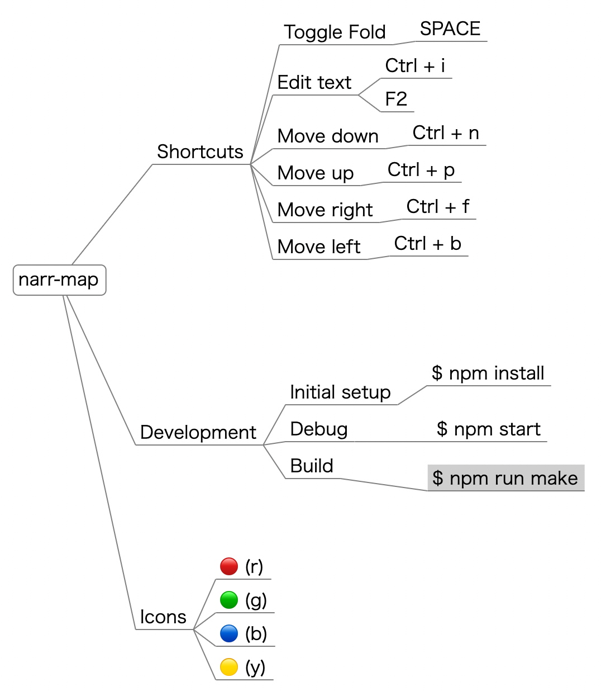

# narr-map

A minimal mind map editor made with Electron. The interface is almost compatible with Free-mind.



## Downloads
- [MacOSX (Apple Silicon)](https://github.com/miyosuda/narr-map/releases/download/v0.0.6/narr-map-darwin-arm64-0.0.6.zip)

- [MaxOSX (Intel)](https://github.com/miyosuda/narr-map/releases/download/v0.0.6/narr-map-darwin-x64-0.0.6.zip)

- [Windows (Experimental)](https://github.com/miyosuda/narr-map/releases/download/v0.0.6/narr-map-0.0.6.Setup.exe)


## Icons

| Text | Icon    |
| ---- | ----  |
| (r)  | :red_circle:   |
| (g)  | :green_circle:  |
| (b)  | :large_blue_circle:   |
| (y)  | :yellow_circle:  |


## Shortcuts

| Key |     |
| ---- | ----  |
| Enter   | Add sibling node |
| Tab     | Add child node |
| Space   | Toggle fold   |
| Ctrl+i  | Edit text  |
| Ctrl+n  | Move down  |
| Ctrl+p  | Move up  |
| Ctrl+f  | Move right |
| Ctrl+b  | Move left |
| Cmd+m | Auto fill blank node. (Requires OpenAI API key) |
| F2      | Edit text  |


## Development

### Initial setup

```
$ npm install
```


### Debug

```
$ npm start
```

### Build

MacOSX arm64

```
$ npm run make -- --arch=arm64
```


MacOSX intel
```
$ npm run make -- --arch=x64
```


### Test

```
$ npm run test
```
